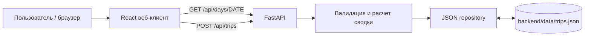
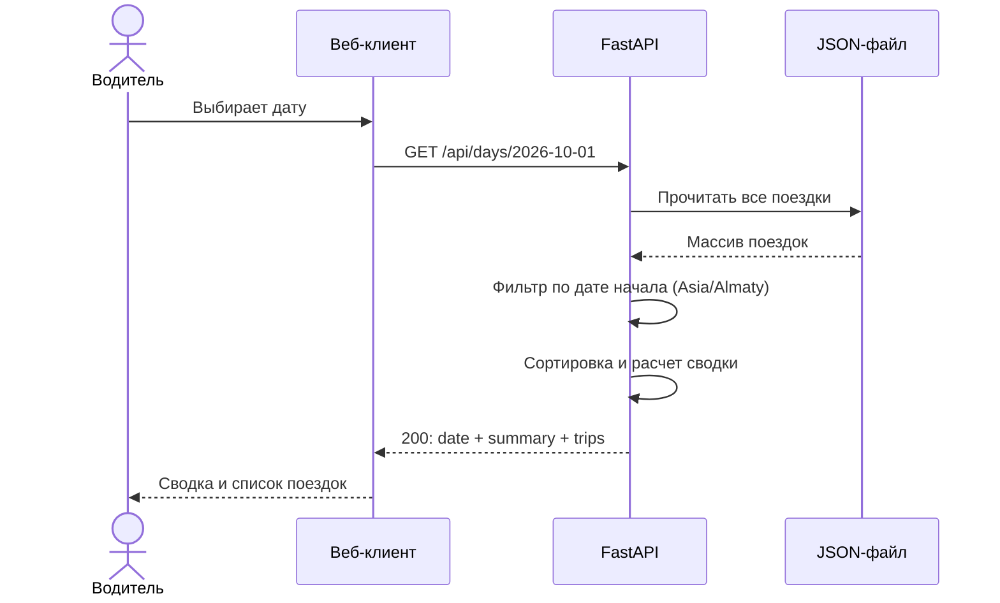

# CLAUDE.md — Дневник смен водителя (MVP)

> **Назначение документа:** самостоятельное техническое задание и инструкция для Claude Code на реализацию работающего MVP веб-приложения. Следовать этому документу как источнику истины. **Не добавлять функциональность за рамками MVP** без технической необходимости.
>
> **Приоритет:** корректность бизнес-логики → понятный API → работающий интерфейс → воспроизводимый запуск → тесты → аккуратное оформление.

## 1. Цель и результат

Создать небольшое веб-приложение **«Дневник смен водителя»**, которое использует JSON-файл с поездками и позволяет:

1. Получить с сервера список поездок за выбранную календарную дату и сводку за эту дату.
2. Увидеть на веб-странице сводку и поездки; переключаться между днями.
3. Добавить поездку через API с валидацией: сумма строго положительна, конец позже начала, недопустимые данные отклоняются.
4. Повторно отправить ту же поездку без появления дубля.
5. Проверить расчет сводки и идемпотентность добавления автоматическими тестами.

**Итоговые артефакты:** публично публикуемый исходный код, `README.md` с инструкцией запуска и описанием выполненного, тесты, файл примера поездок, краткое описание использования ИИ. Не утверждать, что репозиторий опубликован, пока фактически не опубликован.

## 2. Зафиксированные решения для MVP

| Область | Решение | Почему |
|---|---|---|
| Формат | Адаптивное веб-приложение + HTTP API | Соответствует заданию и удобен для демонстрации |
| Backend | Python 3.12+, FastAPI, Pydantic | Простой API, валидация, OpenAPI-документация |
| Frontend | React + TypeScript + Vite | Компактный веб-клиент |
| Хранение | Локальный JSON-файл `backend/data/trips.json` | Входные данные по заданию — JSON; БД для MVP не нужна |
| Тесты backend | pytest + FastAPI TestClient | Быстрая проверка API и бизнес-логики |
| Тесты frontend | Не обязательны; при наличии времени — один smoke-тест | В исходном задании тесты требуются для расчетов и дублей |
| Формат денег | Целые неотрицательные значения в тенге (KZT) | Исходный пример использует целые суммы; исключаем ошибки float |
| Дата отчетности | Календарная дата **начала** поездки в `Asia/Almaty` (UTC+05:00) | Однозначное правило группировки, включая поездки через полночь |
| Комиссия | Фиксированная сумма `commission` в тенге, **не процент** | Соответствует входному JSON |
| Ключ уникальности | `id` поездки, назначаемый отправителем | Детерминированная защита от повторной отправки |

**Не внедрять** учетные записи, роли, авторизацию, геолокацию, карты, интеграцию с такси/банками, аналитику по неделям/месяцам, редактирование/удаление поездок, экспорт, внешние БД, Docker/Kubernetes, платежные операции или push-уведомления. Обычный локальный запуск должен работать без внешних сервисов.

## 3. Бизнес-правила

### 3.1. Поездка

Каждая поездка содержит:

| Поле | JSON-тип | Обязательность | Правило |
|---|---|---|---|
| `id` | string | Да | Непустой идентификатор, 1–100 символов, уникален в файле; пробелы по краям не допускаются |
| `start` | string, ISO 8601 | Да | Валидная дата-время **с часовым поясом** (например `2026-10-01T08:10:00+05:00`) |
| `end` | string, ISO 8601 | Да | Валидная дата-время с часовым поясом; абсолютный момент времени строго позже `start` |
| `amount` | integer | Да | `amount > 0`, bool/float/string не допускаются |
| `payment` | string | Да | Только `cash` или `card` (строчные литералы) |
| `commission` | integer | Да | `0 <= commission <= amount`, bool/float/string не допускаются |

Неизвестные поля в запросе на создание поездки отклоняются. Не допускать неоднозначных timestamp без часового пояса. Поля `start`/`end` могут содержать различные корректные смещения UTC; сравнивать **моменты времени**, а для отчетной даты переводить `start` в `Asia/Almaty`. Не ограничивать продолжительность поездки произвольным верхним пределом — такого требования нет.

**Примечание о суммах:** `amount` — полная стоимость поездки; `commission` — удержанная комиссия; `net = amount - commission`. Комиссия удерживается одинаково независимо от `cash`/`card`.

### 3.2. Сводка за день

Для даты `D` отобрать поездки, у которых `start`, переведенный в `Asia/Almaty`, имеет календарную дату `D`. Отсортировать список по времени начала по возрастанию, при равенстве — по `id`.

Поля и формулы:

- `trip_count` = количество поездок.
- `revenue` = сумма `amount` по всем поездкам.
- `commission` = сумма `commission` по всем поездкам.
- `net` = `revenue - commission` («на руки»).
- `payment_breakdown.cash` = сумма `amount` для `payment = "cash"`.
- `payment_breakdown.card` = сумма `amount` для `payment = "card"`.

**Важно:** разбивка наличные/карта — по **валовой выручке** (до вычета комиссии). Должно выполняться `cash + card = revenue`. В интерфейсе явно подписать «Наличные» и «Карта», не путать выручку и сумму «на руки».

Если за день нет поездок: список `[]`, все агрегаты `0`. Пустая дата — ошибка валидации, а не выбор сегодняшнего дня «по умолчанию» на сервере.

### 3.3. Идемпотентность и дубли

Для **POST** уникальность определяется полем `id`, без дополнительного `Idempotency-Key` в MVP.

1. Новый `id` и валидная поездка → сохранить ровно одну запись; `201 Created`.
2. Тот же `id` и **та же нормализованная бизнес-сущность** → ничего не добавлять; `200 OK`, вернуть сохраненную запись и признак повторной отправки.
3. Тот же `id`, но отличающиеся данные → `409 Conflict` с машинно-читаемым кодом `TRIP_ID_CONFLICT`. Не перезаписывать существующую поездку.
4. Сравнивать `start`/`end` по абсолютным моментам времени (один момент с различными часовыми смещениями считается равным), остальные поля — по точным значениям.
5. Повтор после рестарта сервера также должен распознаваться: проверка по данным в JSON-файле, не только по памяти приложения.

**Конкурентность:** при нескольких одновременных POST в рамках одного серверного процесса нельзя записать два одинаковых `id` или потерять записи. Для MVP допустима блокировка на уровне процесса вокруг операции «прочесть → проверить → записать». Для защиты от поврежденного файла писать во временный файл в том же каталоге и заменять исходный атомарно (`os.replace`). Запускать backend **с одним worker**; не заявлять гарантию для нескольких процессов или распределенных инстансов. Если удобнее и надежнее, использовать кросс-процессную файловую блокировку, но не усложнять ради гипотетического масштабирования.

## 4. Пример входных данных и контрольный расчет

Изначально создать файл `backend/data/trips.json` со следующим содержимым:

```json
[
  {
    "id": "t1",
    "start": "2026-10-01T08:10:00+05:00",
    "end": "2026-10-01T08:32:00+05:00",
    "amount": 2400,
    "payment": "card",
    "commission": 360
  },
  {
    "id": "t2",
    "start": "2026-10-01T09:05:00+05:00",
    "end": "2026-10-01T09:20:00+05:00",
    "amount": 1500,
    "payment": "cash",
    "commission": 225
  }
]
```

Для `2026-10-01` ожидаются: `trip_count = 2`, `revenue = 3900`, `commission = 585`, `net = 3315`, `cash = 1500`, `card = 2400`. Это обязательный контрольный кейс для тестов.

Файл должен оставаться корректным JSON-массивом после операций добавления. При первом запуске включить примерные записи **в репозиторий**; отсутствие файла в другом окружении можно трактовать как пустой массив и создать его при первом сохранении. Если файл существует, но содержит поврежденный JSON или некорректные/дублирующиеся записи, **не удалять и не перезаписывать молча** — вернуть явную серверную ошибку, записать диагностическое сообщение в лог.

## 5. API-контракт (обязательный)

Базовый путь: `/api`. Все ответы — JSON. FastAPI генерирует документацию OpenAPI по адресу `/docs`.

### 5.1. `GET /api/days/{date}` — поездки и сводка за день

**Path parameter:** `date` строго в формате `YYYY-MM-DD`, например `2026-10-01`; несуществующая календарная дата недопустима.

**Запрос:**

```http
GET /api/days/2026-10-01
Accept: application/json
```

**Успешный ответ — `200 OK`:**

```json
{
  "date": "2026-10-01",
  "timezone": "Asia/Almaty",
  "summary": {
    "trip_count": 2,
    "revenue": 3900,
    "commission": 585,
    "net": 3315,
    "payment_breakdown": {
      "cash": 1500,
      "card": 2400
    }
  },
  "trips": [
    {
      "id": "t1",
      "start": "2026-10-01T08:10:00+05:00",
      "end": "2026-10-01T08:32:00+05:00",
      "amount": 2400,
      "payment": "card",
      "commission": 360
    },
    {
      "id": "t2",
      "start": "2026-10-01T09:05:00+05:00",
      "end": "2026-10-01T09:20:00+05:00",
      "amount": 1500,
      "payment": "cash",
      "commission": 225
    }
  ]
}
```

Для даты без поездок возвращать `200` и тот же объект с `trips: []` и нулевыми агрегатами. При недопустимой дате: `422 Unprocessable Entity`.

### 5.2. `POST /api/trips` — добавление поездки

**Запрос:**

```http
POST /api/trips
Content-Type: application/json
```

```json
{
  "id": "t3",
  "start": "2026-10-02T10:00:00+05:00",
  "end": "2026-10-02T10:25:00+05:00",
  "amount": 2000,
  "payment": "cash",
  "commission": 300
}
```

**Новая поездка — `201 Created`:**

```json
{
  "trip": {
    "id": "t3",
    "start": "2026-10-02T10:00:00+05:00",
    "end": "2026-10-02T10:25:00+05:00",
    "amount": 2000,
    "payment": "cash",
    "commission": 300
  },
  "duplicate": false
}
```

**Идентичный повтор — `200 OK`:** то же содержимое `trip`, `duplicate: true`; число поездок не меняется.

**Конфликт `id` — `409 Conflict`:**

```json
{
  "error": {
    "code": "TRIP_ID_CONFLICT",
    "message": "Trip with this id already exists with different data"
  }
}
```

**Невалидные поля — `422 Unprocessable Entity`:** допустим стандартный формат ошибки FastAPI/Pydantic (`detail` с перечнем нарушений); клиент должен уметь показать пользователю читаемое сообщение.

**Серверная ошибка хранилища — `500 Internal Server Error`:** не раскрывать в HTTP-ответе стек вызовов или содержимое файла; детали — в серверном логе.

### 5.3. Минимальная таблица статусов

| Метод | 200 | 201 | 409 | 422 | 500 |
|---|---|---|---|---|---|
| `GET /api/days/{date}` | Найдено (в т. ч. пусто) | — | — | Плохая дата | Ошибка чтения/данных |
| `POST /api/trips` | Идентичный повтор | Создано | Тот же `id`, другие данные | Ошибка валидации | Ошибка хранения |

Не создавать отдельные эндпоинты для списка дней, сводки, удаления, редактирования или health-check, если нет необходимости. Один GET возвращает сразу и сводку, и поездки — **не два отдельных запроса**.

## 6. Диаграммы взаимодействия

### 6.1. Компоненты



### 6.2. Просмотр выбранного дня



### 6.3. Добавление и повтор

```mermaid
sequenceDiagram
    actor Client as Клиент API / форма
    participant API as FastAPI
    participant Repo as JSON repository
    Client->>API: POST /api/trips
    API->>API: Проверить схему и бизнес-правила
    API->>Repo: В блокировке: прочитать и найти id
    alt id отсутствует
        Repo->>Repo: Дописать + атомарно сохранить
        Repo-->>API: Создано
        API-->>Client: 201; duplicate=false
    else id есть, содержимое совпадает
        Repo-->>API: Исходная поездка
        API-->>Client: 200; duplicate=true
    else id есть, содержимое отличается
        Repo-->>API: Конфликт
        API-->>Client: 409; TRIP_ID_CONFLICT
    end
```

## 7. Веб-интерфейс

**Одна страница**, на русском языке; минимальный аккуратный адаптивный дизайн без тяжелых UI-библиотек. Основной сценарий — просмотр поездок за выбранную дату.

**Обязательные элементы:**

1. Заголовок «Дневник смен водителя».
2. Поле выбора даты (`input type="date"`) и кнопки «Предыдущий день» / «Следующий день»; начальная дата — текущий день **в часовом поясе Asia/Almaty**, а не просто локаль браузера.
3. Карточки сводки: «Поездок», «Выручка», «Комиссия», «На руки», «Наличные», «Карта».
4. Список/таблица поездок выбранного дня с полями: начало, окончание, сумма, способ оплаты, комиссия (при желании показывать `id` для отладки).
5. Состояния `Загрузка`, `Нет поездок за выбранный день`, `Не удалось загрузить данные` с возможностью повторить запрос.
6. Суммы выводить как целые KZT с разделителем тысяч, например `3 900 ₸`.

**Добавление поездки в UI:** исходное требование гарантирует добавление **через API**, а не обязательно с экрана. Тем не менее для демонстрационного MVP реализовать **простую форму** на этой же странице (без отдельного маршрута): `id`, `start`, `end`, `amount`, `payment`, `commission`; кнопка «Добавить поездку». Допустимо использовать HTML `datetime-local` для ввода времени **с явной подписью «Время Алматы (UTC+05:00)»** и преобразовать введенное значение в строку с `+05:00` перед POST. Не превращать время браузера в источник изменения часового пояса. При успешном добавлении обновить список и сводку текущего выбранного дня; если новая поездка относится к другому дню, показать сообщение об успехе и не менять выбранную дату автоматически. Показывать отдельно созданную и уже существовавшую идентичную поездку; при `409` объяснить конфликт `id`. У формы должны быть простые клиентские проверки, но **серверная валидация обязательна независимо от клиента**.

**Пример схематичного экрана:**

```text
┌───────────────────────────────────────────────────────────────┐
│ Дневник смен водителя                                        │
│ [← Предыдущий] [ 2026-10-01 📅 ] [Следующий →]               │
├───────────────────────────────────────────────────────────────┤
│ Поездок  2     Выручка 3 900 ₸      Комиссия 585 ₸           │
│ На руки 3 315 ₸    Наличные 1 500 ₸    Карта 2 400 ₸         │
├───────────────────────────────────────────────────────────────┤
│ Поездки                                                      │
│ 08:10–08:32 | Карта    | 2 400 ₸ | комиссия 360 ₸            │
│ 09:05–09:20 | Наличные | 1 500 ₸ | комиссия 225 ₸            │
├───────────────────────────────────────────────────────────────┤
│ Добавить поездку                                             │
│ ID [t3]       Начало [дата/время]   Конец [дата/время]       │
│ Сумма [2000]  Оплата [Наличные ▼]   Комиссия [300]           │
│ [Добавить поездку]                                           │
└───────────────────────────────────────────────────────────────┘
```

## 8. Структура проекта

Рекомендуемая структура; допускаются небольшие изменения имен, **если сохраняются API-контракты и простота**:

```text
driver-shift-diary/
├── CLAUDE.md
├── README.md
├── .gitignore
├── backend/
│   ├── pyproject.toml             # зависимости и настройки pytest
│   ├── app/
│   │   ├── __init__.py
│   │   ├── main.py                # FastAPI, маршруты, CORS (для локальной разработки)
│   │   ├── models.py              # схемы Pydantic, правила валидации
│   │   ├── service.py             # расчет сводки, отбор/сортировка
│   │   └── repository.py          # JSON файл, защита от дублей, атомарная запись
│   ├── data/
│   │   └── trips.json             # демонстрационные входные данные
│   └── tests/
│       ├── test_summary.py
│       ├── test_idempotency.py
│       └── test_validation.py
└── frontend/
    ├── package.json
    ├── index.html
    └── src/
        ├── main.tsx
        ├── App.tsx
        ├── api.ts                # типизированные вызовы GET/POST
        ├── types.ts              # Trip, Summary, DayResponse
        └── styles.css
```

**Изоляция тестов:** все тесты записи должны работать с **временным JSON-файлом** в `tmp_path`, а не менять коммитнутый `backend/data/trips.json`. Путь к JSON сделать конфигурируемым через переменную окружения `TRIPS_FILE` или инъекцию зависимости репозитория. Извлекать бизнес-логику расчета сводки в отдельную тестируемую функцию, не связывать ее с HTTP.

## 9. Проработка реализации backend

- Pydantic-схемы запроса/ответа; точные типы для денежных полей (`StrictInt` или эквивалент), `Literal['cash','card']`, запрет extra-полей.
- Проверять `end > start` после приведения обеих дат к сравнимым timezone-aware моментам.
- Загрузка всего JSON-массива и фильтрация в памяти допустимы в MVP. Не вводить искусственные ограничения на количество записей, не строить БД или кеш.
- При чтении валидировать сохраненные записи теми же доменными правилами. Отдельно определять дубли `id` в существующем файле как нарушение целостности.
- Для POST блокировать критическую секцию **до чтения файла и до завершения замены файла**; при ошибках сохранения не отвечать `201`.
- В ответах можно сохранять исходное смещение UTC корректно валидного timestamp; для сравнения дублей нормализовать внутренние значения. JSON-представление `start/end` не должно неожиданно терять информацию о часовом поясе.
- Для даты использовать строгое сопоставление регулярному формату `YYYY-MM-DD` плюс реальную календарную валидацию; FastAPI тип `date` сам по себе может принять дополнительные ISO-формы, поэтому проверить контракт отдельно.
- Логировать ошибки чтения, парсинга и записи без чувствительных данных. Не маскировать повреждение файла под пустой день.
- Разрешить фронтенду в dev-режиме обращаться к `http://localhost:8000` через Vite proxy `/api` (предпочтительно), либо точечный CORS для `http://localhost:5173`.

## 10. Проработка реализации frontend

- Использовать React hooks (`useState`, `useEffect`); при смене даты показывать только ответ для **актуально выбранной даты** (например, `AbortController` или guard против устаревшего ответа).
- API-вызовы вынести в `src/api.ts`. Не дублировать расчеты агрегатов на клиенте: отображать **значения с сервера**.
- Не вычислять дату `new Date().toISOString().slice(0, 10)` для «сегодня» — это UTC-дата и может отличаться от Алматы. Применить `Intl.DateTimeFormat(..., { timeZone: 'Asia/Almaty' })` или эквивалент.
- Форматировать денежные суммы локалью `ru-KZ` либо `ru-RU` с добавлением `₸`, не показывать дробные копейки.
- При отправке формы показать состояние сохранения, временно заблокировать повторное нажатие; тем не менее полагаться на серверную идемпотентность.
- Отображать пользовательские ошибки валидации, конфликта и сети; не выводить сырые tracebacks.
- Интерфейс должен корректно сжиматься до мобильной ширины, без горизонтального переполнения всего экрана (таблица может быть адаптирована карточками).

## 11. Обязательные тестовые сценарии

### 11.1. Расчет сводки

| ID | Сценарий | Ожидаемый результат |
|---|---|---|
| S01 | Две поездки из примера за `2026-10-01` | 2, 3900, 585, 3315, cash 1500, card 2400 |
| S02 | Дата без поездок | 0 по всем показателям, пустой список |
| S03 | Разные способы оплаты | `cash + card == revenue` |
| S04 | Поездка стартует в `23:50` и заканчивается на следующий день | Попадает только на дату **начала** |
| S05 | Начало в часовом поясе, отличном от `+05:00` | Группировка по дате `Asia/Almaty`, а не по текстовой дате timestamp |
| S06 | Несколько поездок в несортированном файле | Возвращаются по возрастанию `start`, затем `id` |

### 11.2. Идемпотентность и валидация

| ID | Сценарий | Ожидаемый результат |
|---|---|---|
| I01 | POST новой валидной поездки | 201, `duplicate=false`, одна новая запись |
| I02 | Повтор точно такого же POST | 200, `duplicate=true`, по-прежнему одна запись данного `id` |
| I03 | Тот же `id`, другая сумма | 409, файл не изменился |
| I04 | Тот же `id`, эквивалентные timestamp с другими смещениями | 200, дубликат, новая запись не создается |
| I05 | Повтор с новым экземпляром приложения/репозитория и тем же файлом | Дубликат распознан после «рестарта» |
| I06 | Две одновременно отправленные одинаковые записи | Ни одного дубля; файл корректен |
| V01 | `amount=0` или отрицательная сумма | 422 |
| V02 | `end <= start` | 422 |
| V03 | `commission < 0` или `commission > amount` | 422 |
| V04 | `payment` не `cash/card` | 422 |
| V05 | Timestamp без UTC-смещения | 422 |
| V06 | Невалидная дата в GET | 422 |
| V07 | `amount`/`commission` — float, bool или string | 422 |
| V08 | Неизвестное поле либо пустой `id` | 422 |
| E01 | Существующий файл с поврежденным JSON | Явная ошибка сервера; данные не потеряны |

Минимально обязательные тесты — **S01, S02, S04, I01, I02, I03, I05, V01, V02**. Стремиться реализовать всю таблицу — объем небольшой. При проверке конкурентности избегать недетерминированного flaky-теста: использовать barrier или явную одновременную отправку в один экземпляр приложения. Не заявлять поддержку нескольких worker.

## 12. Команды и воспроизводимость

Указать фактически работающие команды в `README.md`. Рекомендуемый сценарий разработки:

**Backend (терминал 1):**

```bash
cd backend
python -m venv .venv
# Windows PowerShell: .venv\Scripts\Activate.ps1
# macOS/Linux: source .venv/bin/activate
pip install -e '.[dev]'
uvicorn app.main:app --reload --port 8000
```

**Frontend (терминал 2):**

```bash
cd frontend
npm install
npm run dev
```

В результате веб-приложение должно открываться по `http://localhost:5173`, API — по `http://localhost:8000`, API-документация — по `http://localhost:8000/docs`.

**Тесты:**

```bash
cd backend
pytest -q
```

**Проверка API через curl:**

```bash
curl http://localhost:8000/api/days/2026-10-01

curl -i -X POST http://localhost:8000/api/trips \
  -H 'Content-Type: application/json' \
  -d '{"id":"t3","start":"2026-10-02T10:00:00+05:00","end":"2026-10-02T10:25:00+05:00","amount":2000,"payment":"cash","commission":300}'
```

Примечание: пример `curl` в документации ориентирован на bash; для PowerShell можно предоставить вариант `Invoke-RestMethod` или готовые примеры Swagger UI. Не считать отсутствие `curl` на Windows проблемой приложения.

**Git:** добавить `.gitignore` для `.venv/`, `__pycache__/`, `.pytest_cache/`, `node_modules/`, `dist/`, `.env`, локальных временных файлов. **Не игнорировать** демофайл `backend/data/trips.json`.

## 13. README.md — обязательные разделы

1. Краткое описание проекта (задача и стек).
2. Реализованные возможности (с конкретными маршрутами API).
3. Структура проекта.
4. Предварительные требования (Python, Node.js/npm).
5. Пошаговый запуск backend и frontend.
6. Как запускать тесты.
7. Примеры `GET` и `POST`, поведения повторной отправки (`201`, `200`, `409`).
8. Указание `Asia/Almaty`, правила отнесения поездки ко дню и формул финансовой сводки.
9. **«Как использовал ИИ»**: написать краткую, **правдивую** заметку о применении Claude Code; указать хотя бы одну **реально обнаруженную** ошибку/недочет ИИ и как ее исправили, **только если это действительно происходило**. Не сочинять ошибку. Если таких эпизодов не было, честно написать, что заметных ошибок не выявлено, и какие проверки проведены вручную.
10. При желании — раздел со скриншотами/демо, без обязательного деплоя.

## 14. Критерии приемки (Definition of Done)

Результат считается готовым только если:

- [ ] Репозиторий содержит frontend, backend, пример `trips.json`, `README.md`, `CLAUDE.md`.
- [ ] Backend запускается локально и выдает `/docs`.
- [ ] `GET /api/days/2026-10-01` возвращает корректную сводку **3900 / 585 / 3315** и обе поездки.
- [ ] Переключение дней обновляет одновременно карточки и список поездок.
- [ ] Пустая дата корректно отображается нулями и сообщением об отсутствии поездок.
- [ ] `POST /api/trips` создает запись и сохраняет ее в JSON.
- [ ] Второй идентичный POST не создает дубль, даже после «рестарта».
- [ ] POST с существующим `id`, но другими полями возвращает `409`.
- [ ] POST с `amount <= 0` или `end <= start` возвращает `422`.
- [ ] Файл не повреждается из-за одновременных POST в одном процессе.
- [ ] Тесты backend проходят (`pytest -q`).
- [ ] Фронтенд успешно собирается (`npm run build`).
- [ ] README содержит проверенные команды запуска и честное описание применения ИИ.
- [ ] Нет секретов, ключей API, платных/внешних зависимостей и функциональности вне MVP.

**Отдельно:** публичный репозиторий в GitHub/GitLab создается только с доступом владельца. Claude Code должен **подготовить локальный git-проект и команды публикации**, но не публиковать его без явно предоставленного доступа и разрешения.

## 15. Инструкция агенту Claude Code — порядок работы

Выполняй задачу последовательно, не ограничивайся планом и не останавливайся после создания scaffolding.

1. Прочитай этот `CLAUDE.md` полностью. Если репозиторий пустой — создай структуру. Если уже есть код — изучи его и минимально адаптируй, не ломая рабочие части.
2. Реализуй Pydantic-модели и чистую функцию расчета сводки.
3. Реализуй JSON repository с проверкой целостности, блокировкой критической секции и атомарной записью.
4. Реализуй API строго по двум описанным маршрутам и типизированным схемам.
5. Добавь пример JSON и pytest-тесты на агрегаты, даты, валидацию, дубли и сохранение.
6. Реализуй React-клиент: выбор даты, отображение сводки, список, состояния загрузки/ошибки, простая форма POST.
7. Настрой Vite proxy, стили адаптивной страницы и удобный запуск.
8. Запусти имеющиеся проверки: `pytest -q`, `npm run build`; исправь ошибки. Если не удалось запустить команды по причинам окружения — явно перечисли это в финальном отчете; не утверждай, что проверки прошли.
9. Напиши `README.md` с рабочими инструкциями и API-примерами. В разделе применения ИИ **не придумывай факты** об ошибках. При необходимости оставь честную пометку автору проекта дополнить личным опытом.
10. В итоговом сообщении кратко перечисли созданные файлы, реализованные сценарии, результат тестов, известные ограничения и команды запуска. Не требуй от пользователя микрорешений, когда все правила уже определены в документе.

### Принципы реализации

- **Не избыточно:** простые компоненты, без лишних слоев абстракции, CQRS, брокеров, ORM и сервисной сетки.
- **Не менять контракт** `GET /api/days/{date}` и `POST /api/trips` без необходимости.
- **Проверяемо:** любой расчет должен быть воспроизводим по `trips.json`.
- **Сохранность:** не стирать исходный JSON при ошибках.
- **Понятно проверяющему:** короткий путь от `git clone` до работающей страницы и `pytest`.
- **Честная отчетность:** различать реализованное, протестированное и не проверенное.

---

**Область MVP фиксирована.** Основные требования — ежедневный отчет, переключение дат, создание поездки через API с проверкой и без дублей, тестирование. Всё остальное допускается только для минимально необходимой работоспособности этих сценариев.
