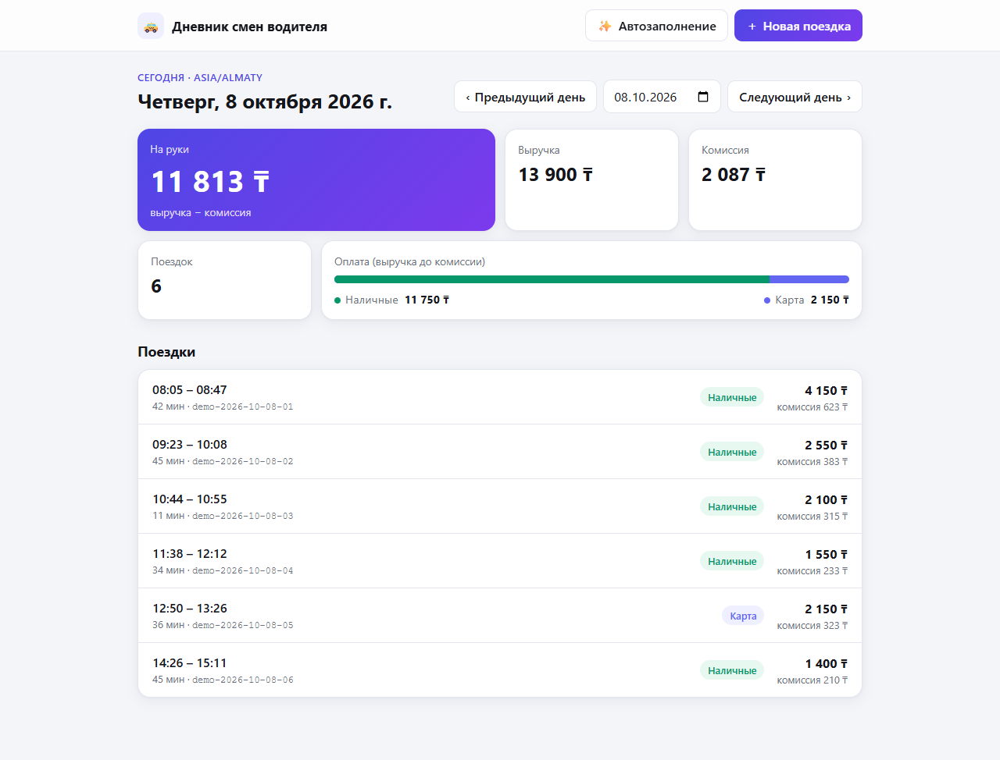
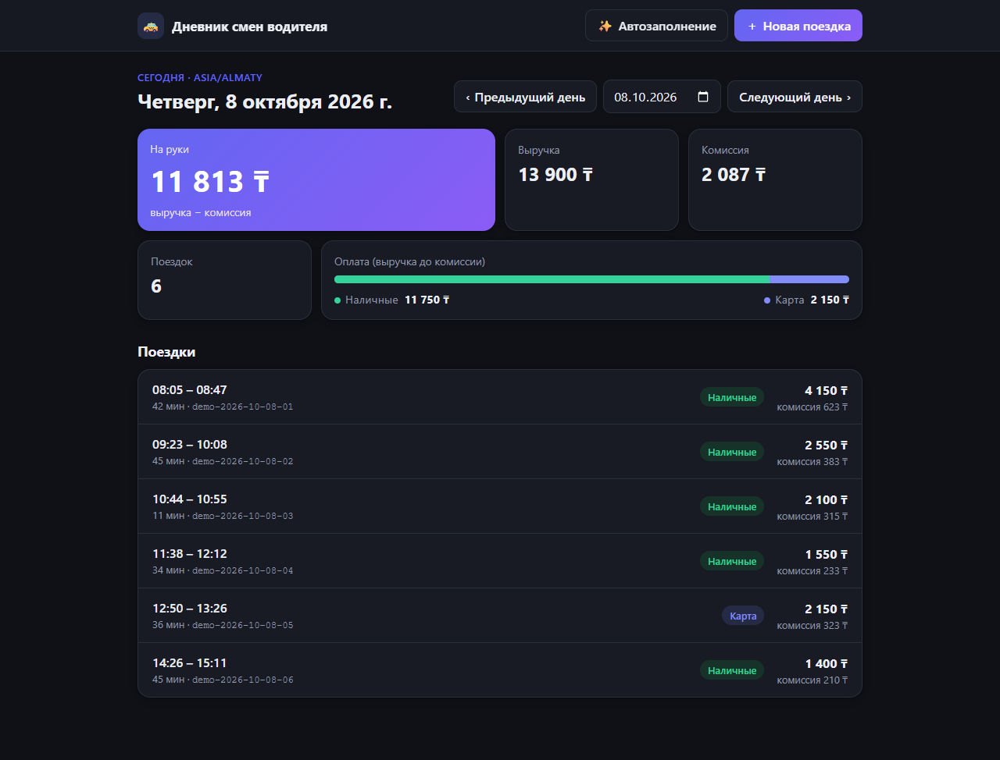
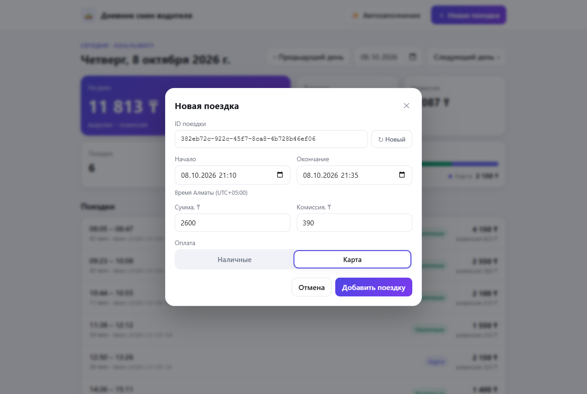
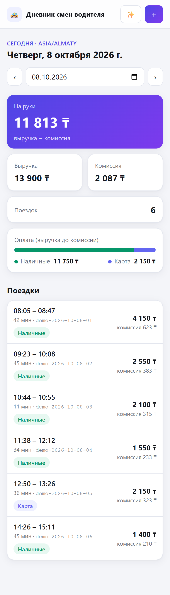

# Дневник смен водителя

Небольшое веб-приложение для водителя такси: поездки и финансовая сводка за выбранный день, добавление поездки через API с валидацией и защитой от дублей.

**Стек:** Python 3.12 · FastAPI · Pydantic v2 · pytest — backend; React 18 · TypeScript · Vite — frontend. Хранилище — JSON-файл `backend/data/trips.json`, без БД и внешних сервисов.

## Скриншоты

Отчёт за день (светлая и тёмная тема — по настройке системы):



| Тёмная тема | Добавление поездки | Телефон |
|---|---|---|
|  |  |  |

Данные на скриншотах созданы кнопкой «Автозаполнение».

## Реализовано

- `GET /api/days/{date}` — поездки за дату `YYYY-MM-DD` и сводка одним запросом (`200`; для пустого дня — нули и `trips: []`; `422` для невалидной даты).
- `POST /api/trips` — добавление поездки:
  - `201` — новая поездка, `duplicate: false`;
  - `200` — идентичный повтор, `duplicate: true`, дубль не создаётся;
  - `409` — тот же `id` с другими данными, код `TRIP_ID_CONFLICT`, файл не меняется;
  - `422` — ошибка валидации (`amount > 0`, `0 <= commission <= amount`, `end > start`, timestamp с часовым поясом, `payment` ∈ `cash|card`, целые суммы, без лишних полей, `id` 1–100 символов без пробелов по краям);
  - `500` — ошибка хранилища (повреждённый/некорректный JSON); файл не перезаписывается, детали только в логе сервера.
- Идемпотентность по `id`, проверка по файлу (работает и после рестарта); один и тот же момент с разными UTC-смещениями считается одинаковым.
- Блокировка «прочитать → проверить → записать» в процессе и атомарная запись (временный файл + `os.replace`).
- Одностраничный веб-клиент (светлая/тёмная тема по настройке системы, адаптивный до 375px). Главный экран — отчёт за день: выбор даты, «Предыдущий/Следующий день», «Сегодня», сводка («На руки», «Выручка», «Комиссия», «Поездок», полоса «Наличные/Карта»), список поездок, состояния загрузки/пусто/ошибка с повтором. Поездка добавляется кнопкой «Новая поездка» в модальном окне. Кнопка «✨ Автозаполнение» добавляет демо-поездки за 7 дней по выбранную дату включительно — через тот же `POST /api/trips`; данные детерминированы по дате (`id` вида `demo-2026-10-08-01`), поэтому повторное нажатие не создаёт дублей (сервер отвечает `200 duplicate`). ID новой поездки форма генерирует сама (UUID v4, `crypto.randomUUID()`); он сохраняется до успешного создания, поэтому повторная отправка после сетевой ошибки распознаётся как дубль. API по-прежнему принимает любой `id` длиной 1–100 символов (например, `t1` из демоданных).
- Описание API: [`openapi.yaml`](openapi.yaml) (OpenAPI 3.0, с готовыми примерами запросов для всех сценариев) и интерактивная документация `http://localhost:8000/docs`.

## Правила расчёта

- Часовой пояс отчётности — **`Asia/Almaty` (UTC+05:00)**.
- Поездка относится к календарной дате своего **начала** в `Asia/Almaty` (поездка 23:50–00:20 попадает на день начала; `2026-10-04T20:30:00Z` — это 5 октября по Алматы).
- Поездки дня сортируются по времени начала, затем по `id`.
- `revenue = Σ amount`, `commission = Σ commission`, `net («на руки») = revenue − commission`.
- `payment_breakdown.cash / card` — **валовая** выручка (до комиссии) по способу оплаты; `cash + card = revenue`.
- Суммы — целые тенге (KZT); комиссия — фиксированная сумма, не процент.

Контрольный пример (`trips.json` из репозитория), `2026-10-01`: 2 поездки, выручка 3900, комиссия 585, на руки 3315, наличные 1500, карта 2400.

## Структура

```text
backend/
  app/main.py          маршруты FastAPI, обработка 409/500
  app/models.py        Pydantic-схемы и правила валидации
  app/service.py       отбор поездок по дню и расчёт сводки (чистые функции)
  app/repository.py    JSON-хранилище: проверка целостности, блокировка, атомарная запись
  data/trips.json      демонстрационные данные
  tests/               pytest: сводка, идемпотентность, валидация
frontend/
  src/App.tsx          страница: отчёт за день
  src/TripDialog.tsx   модальное окно «Новая поездка»
  src/demo.ts          генератор демо-поездок для кнопки «Автозаполнение»
  src/api.ts           типизированные вызовы GET/POST
  src/types.ts         типы Trip, Summary, DayResponse
  vite.config.ts       прокси /api → http://localhost:8000
openapi.yaml           описание API с примерами для ручной проверки
docs/screenshots/      скриншоты для README
```

## Требования

- Python 3.12+
- Node.js 18+ и npm (проверено на Node 22, npm 10)

## Запуск

**Backend** (терминал 1):

```bash
cd backend
python -m venv .venv
# Windows PowerShell: .venv\Scripts\Activate.ps1
# macOS/Linux:        source .venv/bin/activate
pip install -e '.[dev]'
uvicorn app.main:app --reload --port 8000
```

**Frontend** (терминал 2):

```bash
cd frontend
npm install
npm run dev
```

- Веб-приложение: http://localhost:5173 (запросы `/api` проксируются на backend)
- API: http://localhost:8000, документация: http://localhost:8000/docs

Backend запускать **с одним worker** (как выше): защита от гонок — блокировка внутри процесса.
Путь к файлу данных можно переопределить переменной окружения `TRIPS_FILE`.

Сборка frontend: `cd frontend && npm run build`.

## Тесты

```bash
cd backend
pytest -q
```

Тесты пишут только во временный файл (`tmp_path` + `TRIPS_FILE`), коммитнутый `trips.json` не меняется. Покрыты сценарии S01–S06, I01–I06, V01–V08, E01 из ТЗ, в т. ч. конкурентные POST через `threading.Barrier`.

## Проверка API по `openapi.yaml`

[`openapi.yaml`](openapi.yaml) описывает оба маршрута, схемы, коды ответов и содержит именованные примеры запросов: `new` (201, при повторе — 200 `duplicate`), `sameMomentOtherOffset` (200), `sameIdOtherData` (409), `amountZero`, `endBeforeStart`, `noTimezone` (422). В начале файла есть пошаговый сценарий проверки. Сервер — `http://localhost:8000`, backend должен быть запущен.

- **Postman / Insomnia:** Import → выбрать `openapi.yaml`; создаётся коллекция с готовыми запросами.
- **Swagger Editor** (https://editor.swagger.io): File → Import file → «Try it out». Браузер будет обращаться к `localhost:8000` с другого домена, поэтому для отправки запросов удобнее Postman или встроенный `http://localhost:8000/docs`.
- **IDE:** плагины OpenAPI для VS Code/JetBrains открывают файл и позволяют отправлять запросы.

Все примеры из файла проверены на реальном API: статусы и тела ответов совпадают.

## Примеры API

```bash
curl http://localhost:8000/api/days/2026-10-01

curl -i -X POST http://localhost:8000/api/trips \
  -H 'Content-Type: application/json' \
  -d '{"id":"t3","start":"2026-10-02T10:00:00+05:00","end":"2026-10-02T10:25:00+05:00","amount":2000,"payment":"cash","commission":300}'
```

PowerShell:

```powershell
Invoke-RestMethod http://localhost:8000/api/days/2026-10-01
$body = '{"id":"t3","start":"2026-10-02T10:00:00+05:00","end":"2026-10-02T10:25:00+05:00","amount":2000,"payment":"cash","commission":300}'
Invoke-WebRequest -Method Post -Uri http://localhost:8000/api/trips -ContentType 'application/json' -Body $body
```

Повторная отправка:

| Запрос | Ответ |
|---|---|
| Первый POST `t3` | `201 Created`, `{"trip": {...}, "duplicate": false}` |
| Тот же POST ещё раз (в т. ч. после рестарта, или с `"start":"2026-10-02T05:00:00Z"` — тот же момент) | `200 OK`, `{"trip": {...}, "duplicate": true}` |
| `t3` с `"amount": 2500` | `409 Conflict`, `{"error": {"code": "TRIP_ID_CONFLICT", "message": "..."}}` |
| `"amount": 0` или `end <= start` | `422 Unprocessable Entity`, `{"detail": [...]}` |

Ответ `GET /api/days/2026-10-01`:

```json
{
  "date": "2026-10-01",
  "timezone": "Asia/Almaty",
  "summary": {"trip_count": 2, "revenue": 3900, "commission": 585, "net": 3315,
              "payment_breakdown": {"cash": 1500, "card": 2400}},
  "trips": [{"id": "t1", "...": "..."}, {"id": "t2", "...": "..."}]
}
```

## Ограничения

- Гарантии от гонок — в пределах одного процесса (один worker uvicorn); несколько процессов/инстансов не поддерживаются.
- «Автозаполнение» и форма пишут в `backend/data/trips.json`. Вернуть исходные демоданные: `git checkout backend/data/trips.json`.
- Весь файл читается при каждом запросе — достаточно для MVP, без кеша и БД.
- Нет редактирования/удаления поездок, авторизации и отчётов за период — вне рамок ТЗ.

## Как использовал ИИ

Проект целиком сгенерирован Claude Code (модель Claude Opus) по техническому заданию из `CLAUDE.md`: backend, тесты, frontend, README и git-коммиты.

Что проверено фактически:

- `pytest -q` — все тесты проходят;
- `npm run build` — сборка без ошибок TypeScript;
- ручной прогон в браузере на копии данных: сводка 3900/585/3315 за 01.10, пустой день, переключение дней, добавление поездки через форму (в т. ч. через полночь), повтор (сообщение «дубль не создан»), конфликт `id` (409), поездка на другую дату (сообщение без смены даты), ошибка при остановленном backend и восстановление по «Повторить», данные сохраняются после рестарта сервера, вёрстка на ширине 375px без горизонтальной прокрутки страницы; после редизайна — повторно: создание, повтор и конфликт через модальное окно, светлая и тёмная темы, десктоп и 375px;
- `curl`: 201 → 200 → 409, 422 на `2026-02-30`.

Первая версия backend и тестов прошла проверки с первого запуска. Одно неочевидное место выявлено при проектировании, а не после сбоя: Pydantic по умолчанию принимает Unix-timestamp (число) как дату-время, поэтому добавлена явная проверка, что `start`/`end` — строки ISO 8601 (тест V05).

Реальные ошибки ИИ, обнаруженные и исправленные в ходе работы:

- **Непонятная ошибка при остановленном backend.** Пользователь открыл страницу без запущенного backend и увидел «Ошибка сервера (HTTP 500)» — это ответ прокси Vite, а не приложения. ИИ после первой проверки остановил свои серверы, но не учёл этот сценарий в тексте ошибки. Исправлено: ответ без JSON теперь показывается как «сервер API недоступен (запущен ли backend на порту 8000?)».
- **Конфликт CSS-классов при редизайне.** Для точки и метки «Карта» использовался класс `card`, совпавший с классом карточки сводки, — точка легенды растянулась в большой круг. Найдено при визуальной проверке в браузере, классы переименованы в `pay-cash`/`pay-card`.
- **Мелочи интерфейса, найденные при проверке в браузере:** «добавлено 43 поездок» (исправлено на склонение через `Intl.PluralRules`) и заголовок, переносившийся на три строки на ширине 390px (на телефоне у кнопки «Новая поездка» оставлена только иконка).
- **Невалидный `openapi.yaml`.** В первой версии файла было незакавыченное `: ` внутри описания (ошибка парсинга YAML) и `summary: 2026-10-01`, который YAML читает как дату, а не строку. Найдено валидатором `openapi-spec-validator`, исправлено; после этого все примеры из файла прогнаны против реального API.

> _Автору: при желании дополните этот раздел личным опытом работы с ИИ._
